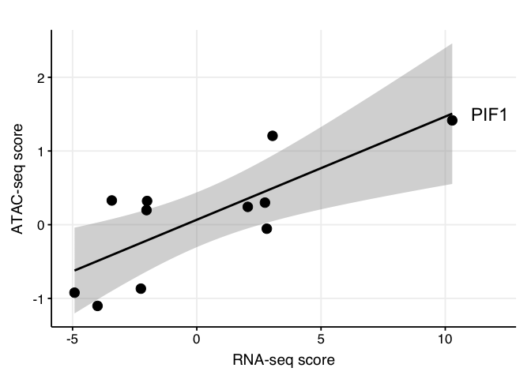

Fig 2D - mRNA and ATAC-seq correlation
================

We show that the eleven genes in the COVID-19 signature are regulated at
the transcriptional and epigenetic levels in a consistent manner.

``` r
source("../scripts/helper_functions.R")
library(dplyr)
library(ggplot2)

# defining the signature genes
signature_genes <- c(
  "PIF1",
  "GUCD1",
  "EHD3",
  "TCEAL3",
  "BANF1",
  "ARAP2",
  "SLC25A46",
  "SLK",
  "ROCK2",
  "TVP23B",
  "DOCK5"
)


# reading results from meta-analysis of COVID-19 training studies
COVID19_pooled_mRNA_analysis <- read.csv2("../../results/suppl_tables/suppl_table_S3.csv")

# define the RNA-seq score for each gene as -log(significance) * fold-change
COVID19_pooled_mRNA_analysis <- COVID19_pooled_mRNA_analysis %>%
  dplyr::rename(gene = X) %>%
  dplyr::mutate(mRNA_score = -log10(effectSizeFDR) * effectSize) %>%
  dplyr::select(gene, mRNA_score) %>%
  dplyr::filter(gene %in% signature_genes)


# reading results from ATAC-seq data analysis
COVID19_ATAC_analysis = read.csv2('../../results/suppl_tables/suppl_table_S2.csv')


# define the ATAC -seq score for each gene as -log(significance) * fold-change
mRNA_ATAC_scores <- merge(COVID19_pooled_mRNA_analysis, COVID19_ATAC_analysis, by = "gene")
mRNA_ATAC_scores <- mRNA_ATAC_scores %>%
  dplyr::mutate(indicator = ifelse(gene %in% signature_genes, "in signature", "background"))


# plotting figure 2D
ggplot(
  mRNA_ATAC_scores %>% dplyr::filter(gene %in% signature_genes),
  aes(x = mRNA_score, y = ATAC_score)
) +
  theme_Publication() +
  geom_smooth(
    method = "lm",
    formula = y ~ x,
    color = "black"
  ) +
  geom_point(size = 4) +
  xlab("RNA-seq score") +
  ylab("ATAC-seq score") +
  xlim(c(-5, 12)) +
  theme(text = element_text(size = 16)) +
  annotate(
    "text",
    x = 11.8,
    y = 1.5,
    label = "PIF1",
    size = 6
  )
```

<!-- -->
