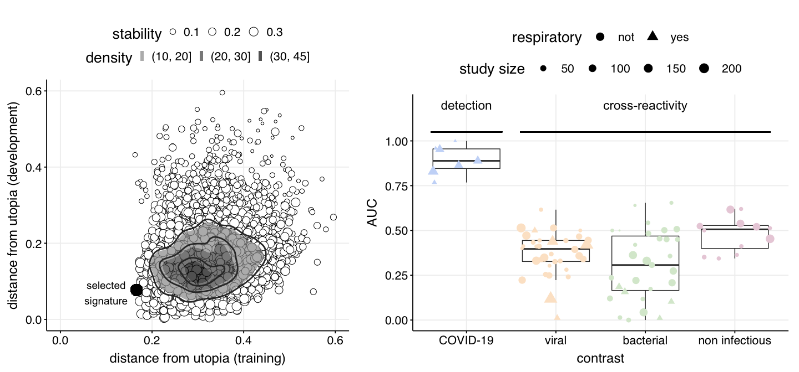

Fig 2A-2B - signature selection and evaluation in training studies
================

We select the COVID-19 signature out of a population of candidate
signatures generated with a genetic algorithm. The best signature is
selected based on its euclidean distance from the ‘utopia’ signature,
one that would result in perfect detection in COVID-19 studies, and no
cross-reactivity in other study classes (e.g., respiratory infections).

``` r
library(dplyr)
library(ggplot2)
source('../scripts/helper_functions.R')
filter_object <- readRDS("../../data/mRNA_studies/filter_object.RDS")

all_contrasts_dict <-
  readRDS(file = "../../data/mRNA_studies/all_contrasts_dict.RDS")

all_contrasts <-
  readRDS(file = "../../data/mRNA_studies/all_contrasts.RDS")

discovery_dev_studies_idx = which(!(all_contrasts_dict$use %in% 'validation'))
```

The code below takes several hours, results have been saved and load in
the following code chunk.

``` r
# binary_solution_matrix <- readRDS("../../data/optimization_results/binary_solution_matrix.RDS")
#
# # measure gene stability
# solution_stability = get_solution_stability(binary_solution_matrix)
#
# candidate_signatures = apply(binary_solution_matrix, 1,
#                              function(x) get_signature_from_binary_solution(x,
#                                                                             filter_object))
#
# # filter by mean gene overlap between signature genes
# # and genes in the contrasts
# discovery_dev_studies_idx = which(!(all_contrasts_dict$use %in% 'validation'))
# signature_mean_gene_overlap = get_signature_mean_gene_overlap(candidate_signatures,
#                                                               contrasts = all_contrasts[discovery_dev_studies_idx])
#
#
# hist(signature_mean_gene_overlap)
# overlap_summary = summary(signature_mean_gene_overlap)
#
# #filter relevant objects
# candidate_binary_solution_matrix = binary_solution_matrix[which(signature_mean_gene_overlap > overlap_summary[3]), ]
# candidate_signatures = candidate_signatures[which(signature_mean_gene_overlap > overlap_summary[3])]
# solution_stability = solution_stability[which(signature_mean_gene_overlap > overlap_summary[3])]

# distance from utopia of candidate signature considering discovery studies
# discovery_studies_idx = which(all_contrasts_dict$use %in% 'discovery')
# dist_from_utopia_discovery = get_distances_from_utopia(signatures = candidate_signatures,
#                                                             filter_object,
#                                                             all_contrasts[discovery_studies_idx],
#                                                             all_contrasts_dict[discovery_studies_idx, ])
#
# dev_studies_idx = which(all_contrasts_dict$use %in% 'development')
# dist_from_utopia_dev = get_distances_from_utopia(signatures = candidate_signatures,
#                                                  filter_object,
#                                                       all_contrasts[dev_studies_idx],
#                                                       all_contrasts_dict[dev_studies_idx, ])
#
#
# dist_from_utopia_df = data.frame(discovery = dist_from_utopia_discovery,
#                               dev = dist_from_utopia_dev,
#                               stability = solution_stability[1:length(dist_from_utopia_discovery)],
#                               id = 1:length(solution_stability))

# saveRDS(dist_from_utopia_df, '../../results/dist_from_utopia_df.RDS')
```

``` r
candidate_signatures <- readRDS("../../results/candidate_signatures.RDS")
dist_from_utopia_df <- readRDS("../../results/dist_from_utopia_df.RDS")
selected_index <- 3116
selected_signature <- candidate_signatures[[selected_index]]
selected_signature
```

    ## $up
    ## [1] "PIF1"   "TCEAL3" "BANF1"  "EHD3"   "GUCD1" 
    ## 
    ## $down
    ## [1] "DOCK5"    "TVP23B"   "SLK"      "SLC25A46" "ARAP2"    "ROCK2"

``` r
p_scatter <- ggplot(dist_from_utopia_df, aes(x = discovery, y = dev, text = id)) +
  geom_point(aes(size = stability),
    fill = "white",
    color = "black",
    pch = 21
  ) +
  xlab("distance from utopia (training)") +
  ylab("distance from utopia (development)") +
  xlim(c(0, 0.6)) +
  ylim(c(0, 0.6)) +
  theme(
    legend.key.size = unit(1, "line"),
    legend.text = element_text(size = 14),
    legend.position = "top"
  ) +
  theme(strip.text.x = element_text(size = 12)) +
  geom_density_2d_filled(alpha = 0.7, breaks = c(10, 20, 30, 45)) +
  geom_density_2d(
    size = 1,
    colour = "gray20",
    bins = 4,
    alpha = 1
  ) +
  theme_Publication() +
  theme(legend.position = "top") +
  scale_fill_manual(values = colorRampPalette(c("gray60", "gray1"))(3)) +
  geom_point(
    aes(
      x = dist_from_utopia_df[selected_index, 1],
      y = dist_from_utopia_df[selected_index, 2]
    ),
    color = "black",
    size = 7
  ) +
  annotate(
    "text",
    x = 0.1,
    y = 0.07,
    label = "selected\nsignature",
    size = 5
  ) +
  theme(text = element_text(size = 20)) +
  labs(fill = "density") +
  theme(legend.direction = "horizontal", legend.box = "vertical")


# distributions of AUCs produced by the selected signature
# in training and development studies
discovery_dev_contrasts_AUC <- compute_contrasts_AUCs(
  selected_signature,
  filter_object,
  all_contrasts[discovery_dev_studies_idx],
  all_contrasts_dict[discovery_dev_studies_idx, ]
)
```

    ## Error in get(genname, envir = envir) : object 'testthat_print' not found

``` r
# get stats on performance
discovery_dev_contrasts_AUC %>%
  group_by(class1) %>%
  summarise(perfomance = quantile(AUC, probs = c(0.25, 0.5, 0.75)))
```

    ## # A tibble: 12 x 2
    ## # Groups:   class1 [4]
    ##    class1         perfomance
    ##    <ord>               <dbl>
    ##  1 COVID-19            0.846
    ##  2 COVID-19            0.889
    ##  3 COVID-19            0.955
    ##  4 viral               0.327
    ##  5 viral               0.397
    ##  6 viral               0.444
    ##  7 bacterial           0.165
    ##  8 bacterial           0.307
    ##  9 bacterial           0.469
    ## 10 non infectious      0.400
    ## 11 non infectious      0.506
    ## 12 non infectious      0.528

``` r
# get boxplot with AUC distributions
p_boxplot <- get_AUC_distribution_boxplot(discovery_dev_contrasts_AUC)

gridExtra::grid.arrange(
  p_scatter,
  p_boxplot,
  nrow = 1,
  widths = c(0.45, 0.55)
)
```

<!-- -->

``` r
sessionInfo()
```

    ## R version 3.6.3 (2020-02-29)
    ## Platform: x86_64-apple-darwin15.6.0 (64-bit)
    ## Running under: macOS Catalina 10.15.7
    ## 
    ## Matrix products: default
    ## BLAS:   /Library/Frameworks/R.framework/Versions/3.6/Resources/lib/libRblas.0.dylib
    ## LAPACK: /Library/Frameworks/R.framework/Versions/3.6/Resources/lib/libRlapack.dylib
    ## 
    ## locale:
    ## [1] en_US.UTF-8/en_US.UTF-8/en_US.UTF-8/C/en_US.UTF-8/en_US.UTF-8
    ## 
    ## attached base packages:
    ## [1] stats     graphics  grDevices utils     datasets  methods   base     
    ## 
    ## other attached packages:
    ## [1] ggplot2_3.3.2 dplyr_1.0.0  
    ## 
    ## loaded via a namespace (and not attached):
    ##  [1] pillar_1.4.4      compiler_3.6.3    tools_3.6.3       testthat_2.3.2   
    ##  [5] digest_0.6.25     evaluate_0.14     lifecycle_0.2.0   tibble_3.0.1     
    ##  [9] gtable_0.3.0      pkgconfig_2.0.3   rlang_0.4.11      cli_2.0.2        
    ## [13] yaml_2.2.1        xfun_0.15         gridExtra_2.3     withr_2.2.0      
    ## [17] stringr_1.4.0     knitr_1.29        generics_0.0.2    vctrs_0.3.1      
    ## [21] isoband_0.2.2     grid_3.6.3        tidyselect_1.1.0  glue_1.4.1       
    ## [25] R6_2.4.1          fansi_0.4.1       rmarkdown_2.3     farver_2.0.3     
    ## [29] purrr_0.3.4       magrittr_2.0.1    scales_1.1.1      ellipsis_0.3.1   
    ## [33] htmltools_0.5.1.1 ggthemes_4.2.0    MASS_7.3-51.5     assertthat_0.2.1 
    ## [37] colorspace_1.4-1  labeling_0.3      utf8_1.1.4        stringi_1.4.6    
    ## [41] munsell_0.5.0     crayon_1.3.4
