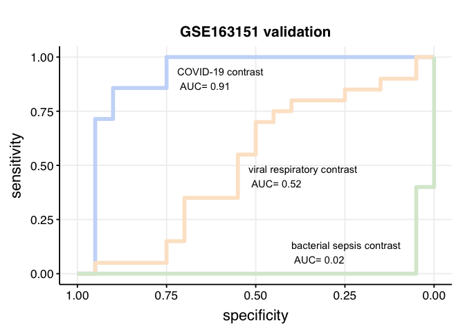
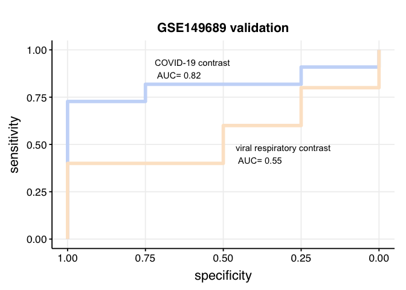
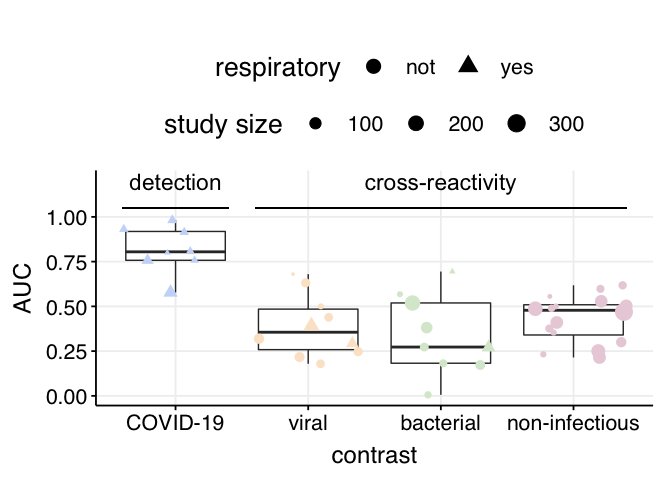
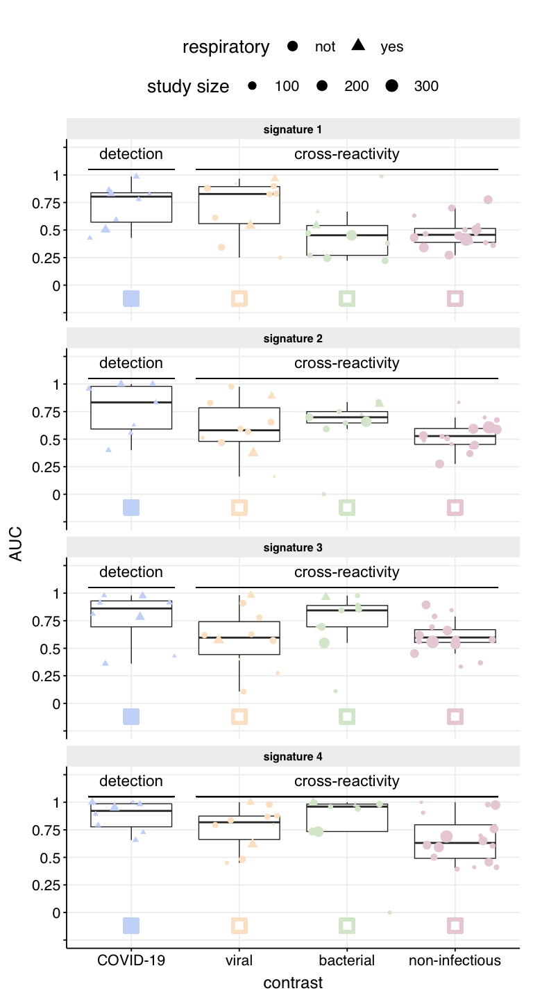

Fig 3 - COVID-19 signature validation
================

Here we assess the generalization performance (including both detection
and cross-reactivity) of the identified 11-gene COVID-19 signature in
independent studies. We then compare the resulting performance with four
previously published signatures.

### Signature performance in GSE163151

This dataset includes samples from COVID-19 patients, from other viral
and bacterial infections, and from healthy controls. Thus, it makes it
possible to simultaneously test COVID-19 detection and cross-reactivity.

``` r
library(dplyr)
```

    ## Warning: replacing previous import 'vctrs::data_frame' by 'tibble::data_frame'
    ## when loading 'dplyr'

``` r
library(ggplot2)
source("../scripts/helper_functions.R")

# signature definition
COVID19_signature_up <-
  c("PIF1", "GUCD1", "EHD3", "TCEAL3", "BANF1")
COVID19_signature_down <-
  c("ARAP2", "SLC25A46", "SLK", "ROCK2", "TVP23B", "DOCK5")

# reading dataset
dataset <-
  readRDS(file = "../../data/mRNA_studies/GSE163151_preprocessed.RDS")
COVID19_signature_up_expression <- dataset$X[COVID19_signature_up, ]
COVID19_signature_down_expression <-
  dataset$X[COVID19_signature_down, ]

# computing signature scores for each sample
sample_score <- scale(
  apply(COVID19_signature_up_expression, 2, function(x) {
    geom_mean(x)
  }) -
    apply(COVID19_signature_down_expression, 2, function(x) {
      geom_mean(x)
    })
)
```

    ## Warning: Can't find generic `testthat_print` in package testthat to register S3 method.
    ## ℹ This message is only shown to developers using devtools.
    ## ℹ Do you need to update testthat to the latest version?

    ## Warning: Can't find generic `testthat_print` in package testthat to register S3 method.
    ## Can't find generic `testthat_print` in package testthat to register S3 method.
    ## ℹ This message is only shown to developers using devtools.
    ## ℹ Do you need to update testthat to the latest version?

``` r
dataset$y[, "disease state:ch1"] <- factor(
  dataset$y[, "disease state:ch1"],
  levels = c(
    "Donor control",
    "COVID-19",
    "Viral acute respiratory illness",
    "Bacterial sepsis"
  )
)

score_df <- data.frame(
  score = sample_score,
  group = dataset$y[, "disease state:ch1"]
) %>%
  dplyr::mutate(group = relevel(group, ref = "Donor control"))


# ROC curve related to COVID-19 vs control
covid_vs_control_roc_curve <- get_roc_curve(score_df,
  control_group = "Donor control",
  positive_group = "COVID-19"
)

# ROC curve related to viral vs control
viral_vs_control_roc_curve <- get_roc_curve(score_df,
  control_group = "Donor control",
  positive_group = "Viral acute respiratory illness"
)

# ROC curve related to bacterial vs control
bact_vs_control_roc_curve <- get_roc_curve(score_df,
  control_group = "Donor control",
  positive_group = "Bacterial sepsis"
)

# plotting the ROC curves for all contrasts
p_roc <- pROC::ggroc(
  list(
    COVID = covid_vs_control_roc_curve,
    viral = viral_vs_control_roc_curve,
    bacterial = bact_vs_control_roc_curve
  ),
  size = 2
) + theme_minimal() +
  scale_colour_manual(values = c("#c9daf8ff", "#fce5cdff", "#d9ead3ff")) +
  annotate(
    "text",
    x = 0.72,
    y = 0.9,
    label = paste(
      "COVID-19 contrast \n AUC=",
      round(
        pROC::auc(covid_vs_control_roc_curve), 2
      )
    ),
    hjust = 0
  ) +
  annotate(
    "text",
    x = 0.52,
    y = 0.45,
    label = paste(
      "viral respiratory contrast \n AUC=",
      round(
        pROC::auc(viral_vs_control_roc_curve), 2
      )
    ),
    hjust = 0
  ) +
  annotate(
    "text",
    x = 0.4,
    y = 0.1,
    label = paste(
      "bacterial sepsis contrast \n AUC=",
      round(pROC::auc(
        bact_vs_control_roc_curve
      ), 3)
    ),
    hjust = 0
  ) +
  theme_Publication() + theme(legend.position = "none") +
  ggtitle("GSE163151 validation") +
  theme(text = element_text(size = rel(4.5))) +
  theme(plot.title = element_text(size = rel(3.5)))

p_roc
```

<!-- -->

### Signature performance in GSE149689

This dataset includes samples from COVID-19 patients and from Flu
patients. Thus, it makes it possible to simultaneously test COVID-19
detection and cross-reactivity with flu.

``` r
dataset <- readRDS(file = "../../data/mRNA_studies/COVID19_validation/GSE149689_pseudobulk_MI.RDS")
COVID19_signature_up_expression <- dataset$expr[COVID19_signature_up, ]
COVID19_signature_down_expression <- dataset$expr[COVID19_signature_down, ]

sample_score <- scale(
  apply(COVID19_signature_up_expression, 2, function(x) {
    geom_mean(x)
  }) -
    apply(COVID19_signature_down_expression, 2, function(x) {
      geom_mean(x)
    })
)

score_df <- data.frame(
  score = sample_score,
  group = dataset$pheno$covid_status
) %>%
  dplyr::mutate(group = relevel(group, ref = "Healthy"))


# ROC curve related to COVID-19 vs control
covid_vs_control_roc_curve <- get_roc_curve(score_df,
  control_group = "Healthy",
  positive_group = "COVID-19"
)

# ROC curve related to viral vs control
viral_vs_control_roc_curve <- get_roc_curve(score_df,
  control_group = "Healthy",
  positive_group = "Flu"
)


p_roc_GSE149689 <- pROC::ggroc(
  list(
    COVID = covid_vs_control_roc_curve,
    viral = viral_vs_control_roc_curve
  ),
  size = 2
) + theme_minimal() +
  scale_colour_manual(values = c("#c9daf8ff", "#fce5cdff")) +
  annotate(
    "text",
    x = 0.72,
    y = 0.9,
    label = paste(
      "COVID-19 contrast \n AUC=",
      round(pROC::auc(covid_vs_control_roc_curve), 2)
    ),
    hjust = 0
  ) +
  annotate(
    "text",
    x = 0.46,
    y = 0.45,
    label = paste(
      "viral respiratory contrast \n AUC=",
      round(pROC::auc(viral_vs_control_roc_curve), 2)
    ),
    hjust = 0
  ) +
  theme_Publication() + theme(legend.position = "none") +
  ggtitle("GSE149689 validation") + theme(text = element_text(size = rel(4.5))) +
  theme(plot.title = element_text(size = rel(3.5)))
p_roc_GSE149689
```

<!-- -->

### Global evaluation for all COVID-19 and non-COVID-19 validation studies.

``` r
filter_object <-
  readRDS("../../data/mRNA_studies/filter_object.RDS")

all_contrasts <-
  readRDS(file = "../../data/mRNA_studies/all_contrasts.RDS")
all_contrasts_dict <-
  readRDS(file = "../../data/mRNA_studies/all_contrasts_dict.RDS")
levels(all_contrasts_dict$class1)[4] <- "non-infectious"

validation_contrasts <- all_contrasts[which(all_contrasts_dict$use == "validation")]
validation_contrasts_dict <- all_contrasts_dict %>% filter(use == "validation")

COVID19_signature <- list(
  up = COVID19_signature_up,
  down = COVID19_signature_down
)

COVID19_validation_contrasts_AUC <- compute_contrasts_AUCs(
  COVID19_signature,
  filter_object,
  validation_contrasts,
  validation_contrasts_dict
)


# generating summary statistics (first quartile, median, third quartile)
COVID19_validation_contrasts_AUC %>%
  group_by(class1, use) %>%
  summarise(perfomance = quantile(AUC, probs = c(0.25, 0.5, 0.75)))
```

    ## # A tibble: 12 x 3
    ## # Groups:   class1, use [4]
    ##    class1         use        perfomance
    ##    <ord>          <fct>           <dbl>
    ##  1 COVID-19       validation      0.757
    ##  2 COVID-19       validation      0.805
    ##  3 COVID-19       validation      0.919
    ##  4 viral          validation      0.258
    ##  5 viral          validation      0.356
    ##  6 viral          validation      0.485
    ##  7 bacterial      validation      0.182
    ##  8 bacterial      validation      0.273
    ##  9 bacterial      validation      0.519
    ## 10 non-infectious validation      0.340
    ## 11 non-infectious validation      0.478
    ## 12 non-infectious validation      0.509

``` r
p_boxplot <- get_AUC_distribution_boxplot(COVID19_validation_contrasts_AUC)

p_boxplot
```

<!-- -->

``` r
compute_AUC_distribution_p_values(COVID19_validation_contrasts_AUC)
```

    ##           class1      p_value
    ## 1       COVID-19 0.0001069842
    ## 2          viral 0.0364964096
    ## 3      bacterial 0.0305954900
    ## 4 non-infectious 0.0238980542

### Comparison with four previously published COVID-19 signatures.

``` r
published_signatures = readRDS('../../data/published_signatures/published_signatures.RDS')

published_signatures = published_signatures[c(4, 1, 3, 2)]
names(published_signatures) = paste('signature', 1:4)
published_signatures_validation_AUC = lapply(published_signatures, 
                                             function(x) compute_contrasts_AUCs(x,
                                                                                filter_object, 
                                                                                validation_contrasts,
                                                                                validation_contrasts_dict))

#from Thair, exclude the discovery study
published_signatures_validation_AUC[[2]] = published_signatures_validation_AUC[[2]] %>% 
  filter(!grepl('GSE152641', study))


#plotting distributions
published_signatures_validation_AUC_long = published_signatures_validation_AUC %>%
  plyr::ldply((rbind))

p_boxplots = get_AUC_distribution_boxplot(published_signatures_validation_AUC_long) + 
  geom_point(aes(x = 1, y = -0.12), shape=22, fill="#c9daf8ff", 
             color="#c9daf8ff", size=5, stroke=3) + 
  geom_point(aes(x = 2, y = -0.12), shape=22, fill="white", 
             color="#fce5cdff", size=5, stroke=3) + 
  geom_point(aes(x = 3, y = -0.12), shape=22, 
             fill="white", color="#d9ead3ff", size=5, stroke=3) + 
  geom_point(aes(x = 4, y = -0.12), shape=22, 
             fill="white", color="#ead1dcff", size=5, stroke=3) + 
  facet_wrap(~.id, ncol = 1) + ylim(c(-0.20, 1)) + 
  scale_y_continuous(limits =c(-0.25, 1.25),
                     breaks = seq(-0.25, 1.25, by = 0.25),
                     labels = c('', seq(0, 1.0, by = 0.25), ''))


#generating summary statistics (first quartile, median, third quartile)
lapply(published_signatures_validation_AUC, function(x) 
  x %>%
    group_by(class1, use) %>%
    summarise(perfomance = quantile(AUC, probs = c(0.25, 0.5, 0.75)), .groups = 'drop')
  )
```

    ## $`signature 1`
    ## # A tibble: 12 x 3
    ##    class1         use        perfomance
    ##    <ord>          <fct>           <dbl>
    ##  1 COVID-19       validation      0.571
    ##  2 COVID-19       validation      0.803
    ##  3 COVID-19       validation      0.838
    ##  4 viral          validation      0.558
    ##  5 viral          validation      0.827
    ##  6 viral          validation      0.894
    ##  7 bacterial      validation      0.271
    ##  8 bacterial      validation      0.453
    ##  9 bacterial      validation      0.541
    ## 10 non-infectious validation      0.388
    ## 11 non-infectious validation      0.457
    ## 12 non-infectious validation      0.515
    ## 
    ## $`signature 2`
    ## # A tibble: 12 x 3
    ##    class1         use        perfomance
    ##    <ord>          <fct>           <dbl>
    ##  1 COVID-19       validation      0.592
    ##  2 COVID-19       validation      0.833
    ##  3 COVID-19       validation      0.979
    ##  4 viral          validation      0.480
    ##  5 viral          validation      0.580
    ##  6 viral          validation      0.784
    ##  7 bacterial      validation      0.647
    ##  8 bacterial      validation      0.699
    ##  9 bacterial      validation      0.75 
    ## 10 non-infectious validation      0.452
    ## 11 non-infectious validation      0.528
    ## 12 non-infectious validation      0.596
    ## 
    ## $`signature 3`
    ## # A tibble: 12 x 3
    ##    class1         use        perfomance
    ##    <ord>          <fct>           <dbl>
    ##  1 COVID-19       validation      0.694
    ##  2 COVID-19       validation      0.861
    ##  3 COVID-19       validation      0.929
    ##  4 viral          validation      0.443
    ##  5 viral          validation      0.596
    ##  6 viral          validation      0.741
    ##  7 bacterial      validation      0.694
    ##  8 bacterial      validation      0.843
    ##  9 bacterial      validation      0.888
    ## 10 non-infectious validation      0.553
    ## 11 non-infectious validation      0.598
    ## 12 non-infectious validation      0.669
    ## 
    ## $`signature 4`
    ## # A tibble: 12 x 3
    ##    class1         use        perfomance
    ##    <ord>          <fct>           <dbl>
    ##  1 COVID-19       validation      0.777
    ##  2 COVID-19       validation      0.922
    ##  3 COVID-19       validation      0.986
    ##  4 viral          validation      0.662
    ##  5 viral          validation      0.818
    ##  6 viral          validation      0.875
    ##  7 bacterial      validation      0.734
    ##  8 bacterial      validation      0.960
    ##  9 bacterial      validation      0.983
    ## 10 non-infectious validation      0.491
    ## 11 non-infectious validation      0.631
    ## 12 non-infectious validation      0.796

``` r
p_boxplots
```

<!-- -->

``` r
lapply(published_signatures_validation_AUC, compute_AUC_distribution_p_values)
```

    ## $`signature 1`
    ##           class1     p_value
    ## 1       COVID-19 0.006687025
    ## 2          viral 0.984613055
    ## 3      bacterial 0.364642079
    ## 4 non-infectious 0.249101190
    ## 
    ## $`signature 2`
    ##           class1    p_value
    ## 1       COVID-19 0.01291761
    ## 2          viral 0.88827598
    ## 3      bacterial 0.92842999
    ## 4 non-infectious 0.86177000
    ## 
    ## $`signature 3`
    ##           class1     p_value
    ## 1       COVID-19 0.008110065
    ## 2          viral 0.824422989
    ## 3      bacterial 0.983007078
    ## 4 non-infectious 0.994141081
    ## 
    ## $`signature 4`
    ##           class1      p_value
    ## 1       COVID-19 4.700727e-05
    ## 2          viral 9.992056e-01
    ## 3      bacterial 9.902240e-01
    ## 4 non-infectious 9.966479e-01

``` r
sessionInfo()
```

    ## R version 3.6.3 (2020-02-29)
    ## Platform: x86_64-apple-darwin15.6.0 (64-bit)
    ## Running under: macOS Catalina 10.15.7
    ## 
    ## Matrix products: default
    ## BLAS:   /Library/Frameworks/R.framework/Versions/3.6/Resources/lib/libRblas.0.dylib
    ## LAPACK: /Library/Frameworks/R.framework/Versions/3.6/Resources/lib/libRlapack.dylib
    ## 
    ## locale:
    ## [1] en_US.UTF-8/en_US.UTF-8/en_US.UTF-8/C/en_US.UTF-8/en_US.UTF-8
    ## 
    ## attached base packages:
    ## [1] stats     graphics  grDevices utils     datasets  methods   base     
    ## 
    ## other attached packages:
    ## [1] ggplot2_3.3.2 dplyr_1.0.0  
    ## 
    ## loaded via a namespace (and not attached):
    ##  [1] Rcpp_1.0.4.6      highr_0.8         pillar_1.4.4      compiler_3.6.3   
    ##  [5] plyr_1.8.6        tools_3.6.3       testthat_2.3.2    digest_0.6.25    
    ##  [9] evaluate_0.15     lifecycle_1.0.1   tibble_3.0.1      gtable_0.3.0     
    ## [13] pkgconfig_2.0.3   rlang_1.0.2       cli_3.3.0         rstudioapi_0.11  
    ## [17] yaml_2.2.1        xfun_0.29         withr_2.2.0       stringr_1.4.0    
    ## [21] knitr_1.39        generics_0.0.2    pROC_1.16.2       vctrs_0.4.1      
    ## [25] grid_3.6.3        tidyselect_1.1.0  glue_1.6.2        R6_2.4.1         
    ## [29] fansi_0.4.1       rmarkdown_2.3     purrr_0.3.4       farver_2.0.3     
    ## [33] magrittr_2.0.1    scales_1.1.1      ellipsis_0.3.2    htmltools_0.5.1.1
    ## [37] ggthemes_4.2.0    colorspace_1.4-1  labeling_0.3      utf8_1.1.4       
    ## [41] stringi_1.4.6     munsell_0.5.0     crayon_1.3.4
