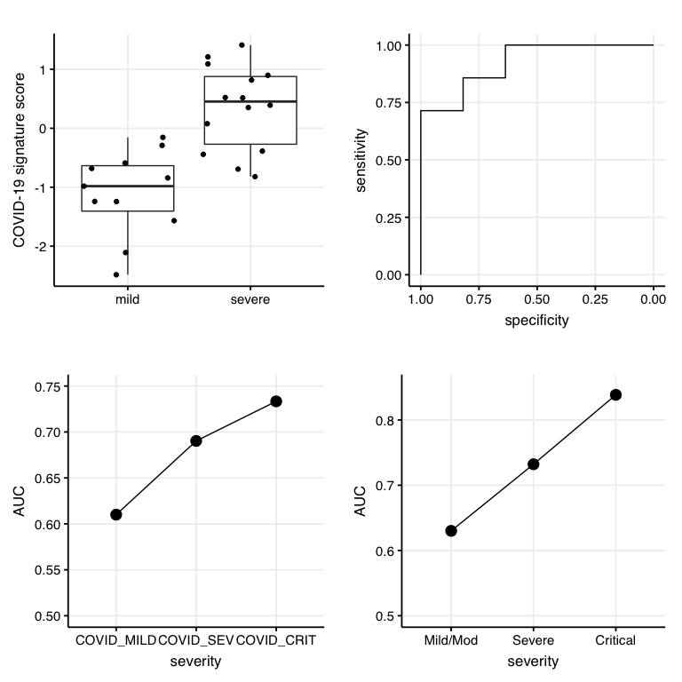

Fig 4 - Analysis of COVID-19 severity
================

``` r
library(dplyr)
library(ggplot2)

source("../scripts/helper_functions.R")
COVID19_signature_up <- c("PIF1", "GUCD1", "EHD3", "TCEAL3", "BANF1")
COVID19_signature_down <- c("ARAP2", "SLC25A46", "SLK", "ROCK2", "TVP23B", "DOCK5")

p_SCHULTE = plot_SCHULTE_results(COVID19_signature_up, COVID19_signature_down)
```

    ## [1] 25 14
    ## 
    ## Call:
    ## roc.default(response = droplevels(C19_ulas_meta$group_per_sample),     predictor = as.numeric(C19_ulas_meta$score))
    ## 
    ## Data: as.numeric(C19_ulas_meta$score) in 11 controls (droplevels(C19_ulas_meta$group_per_sample) mild) < 14 cases (droplevels(C19_ulas_meta$group_per_sample) severe).
    ## Area under the curve: 0.9221

``` r
p_COMBAT = plot_COMBAT_results(signature_up = COVID19_signature_up, 
                               signature_down = COVID19_signature_down)
```

    ## [1] 99 19
    ##       value         L1
    ## 1 0.6100000 COVID_MILD
    ## 2 0.6902439  COVID_SEV
    ## 3 0.7333333 COVID_CRIT

``` r
p_STEPHE = plot_STEPHE_results(signature_up = COVID19_signature_up, 
                               signature_down = COVID19_signature_down)
```

    ## [1] 113  16
    ##       value       L1
    ## 1 0.6300287 Mild/Mod
    ## 2 0.7321429   Severe
    ## 3 0.8385417 Critical

``` r
gridExtra::grid.arrange(p_SCHULTE$ulas_box, p_SCHULTE$ulas_roc,
                        p_COMBAT$p_line, p_STEPHE$p_line)
```

<!-- -->
