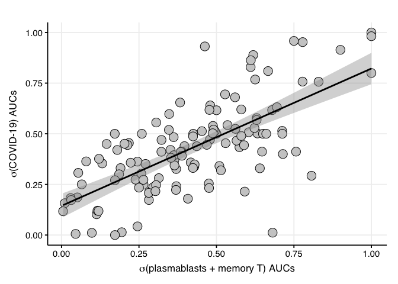
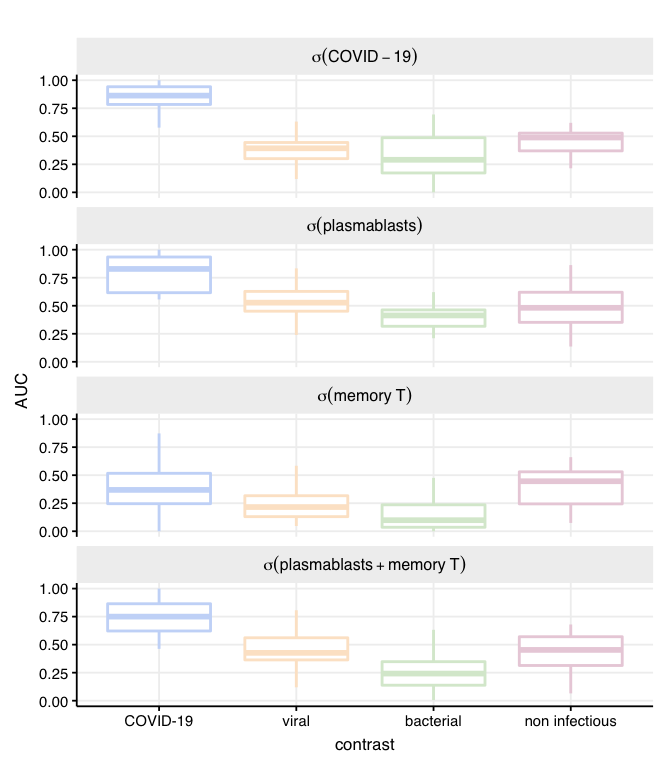

Fig 4 - COVID-19 signature fit
================

Reading data input

``` r
library(dplyr)
library(ggplot2)
source("../scripts/helper_functions.R")

all_contrasts <-
  readRDS(file = "../../data/mRNA_studies/all_contrasts.RDS")

all_contrasts_dict <-
  readRDS(file = "../../data/mRNA_studies/all_contrasts_dict.RDS")

filter_object <-
  readRDS("../../data/mRNA_studies/filter_object.RDS")

annotation_libraries <-
  readRDS("../../data/prior_info/gene_sets_libraries/library_list")
cell_specific_signatures <- c(annotation_libraries$iris)

COVID19_signature <- list(
  up = c("PIF1", "GUCD1", "EHD3", "TCEAL3", "BANF1"),
  down = c("ARAP2", "SLC25A46", "SLK", "ROCK2", "TVP23B", "DOCK5")
)
```

Performing signature alignment

``` r
greedy_cell_specific_alignment <-
  performa_greedy_cell_specific_alignment(
    COVID19_signature,
    cell_specific_signatures,
    all_contrasts,
    all_contrasts_dict,
    filter_object
  )
```

    ## Error in get(genname, envir = envir) : object 'testthat_print' not found
    ## [1] "max correlation obtained at iteration 2"

``` r
# show results
greedy_cell_specific_alignment$best_cell_signature
```

    ## [[1]]
    ## [[1]]$best_cell
    ## [1] "IRIS_PlasmaCell-FromPBMC_up"
    ## 
    ## [[1]]$best_COVID19_cell_signatures_cor2
    ## [1] 0.3344707
    ## 
    ## 
    ## [[2]]
    ## [[2]]$best_cell
    ## [1] "IRIS_PlasmaCell-FromPBMC_up+IRIS_MemoryTcell-RO-unactivated_up"
    ## 
    ## [[2]]$best_COVID19_cell_signatures_cor2
    ## [1] 0.4727243

Plotting results: scatterplot

``` r
best_alignment_AUC <-
  greedy_cell_specific_alignment$contrasts_AUC_long %>% filter(
    .id %in% c(
      "COVID19_AUC",
      "cell_signatures_AUC.IRIS_PlasmaCell-FromPBMC_up",
      "cell_signatures_AUC.IRIS_MemoryTcell-RO-unactivated_up",
      "best_cell_combo_AUC"
    )
  )

best_alignment_AUC <- best_alignment_AUC %>%
  rename(signature = .id) %>%
  dplyr::mutate(signature = gsub("COVID19_AUC", "COVID19", signature)) %>%
  dplyr::mutate(
    signature = gsub(
      "cell_signatures_AUC.IRIS_PlasmaCell-FromPBMC_up",
      "plasmablasts",
      signature
    )
  ) %>%
  dplyr::mutate(
    signature = gsub(
      "cell_signatures_AUC.IRIS_MemoryTcell-RO-unactivated_up",
      "memory_T_cells",
      signature
    )
  ) %>%
  dplyr::mutate(signature = gsub(
    "best_cell_combo_AUC",
    "plasmablasts_and_memory_T_cells",
    signature
  )) %>%
  dplyr::mutate(signature = factor(
    signature,
    levels = c(
      "COVID19",
      "plasmablasts",
      "memory_T_cells",
      "plasmablasts_and_memory_T_cells"
    )
  ))


# scatter plot with correlation
best_alignment_AUC_scatter_df <-
  tidyr::spread(
    best_alignment_AUC %>% select(signature, study, AUC, class1),
    key = signature,
    value = AUC
  )


ggplot(
  best_alignment_AUC_scatter_df,
  aes(x = plasmablasts_and_memory_T_cells, y = COVID19)
) +
  theme_Publication() +
  # geom_point(aes(color = class1), size = 4) +
  geom_point(
    size = 5,
    fill = "gray80",
    colour = "black",
    pch = 21
  ) +
  geom_smooth(
    method = "lm",
    formula = y ~ x,
    color = "black"
  ) +
  theme(
    legend.key.size = unit(2, "line"),
    legend.text = element_text(size = 12),
    legend.position = "top"
  ) +
  ylab(expression(sigma * "(COVID-19) AUCs")) +
  xlab(expression(sigma *
    "(plasmablasts + memory T) AUCs")) +
  labs(color = "contrast") +
  theme(text = element_text(size = 14))
```

<!-- -->

Plotting results: boxplots

``` r
# boxplots with performance distributions
facet_names <- as_labeller(
  c(
    COVID19 = "sigma(COVID-19)",
    plasmablasts = "sigma(plasmablasts)",
    memory_T_cells = "sigma(memory~T)",
    plasmablasts_and_memory_T_cells = "sigma(plasmablasts+memory~T)"
  ),
  default = label_parsed
)

ggplot(best_alignment_AUC, aes(x = class1, y = AUC)) +
  geom_boxplot(outlier.shape = NA, aes(color = class1), size = 1) +
  scale_color_manual(values = c("#c9daf8ff", "#fce5cdff", "#d9ead3ff", "#ead1dcff")) +
  theme_Publication() +
  scale_fill_manual(values = c("white", paste0("gray", seq(20, 60, length.out = 3)))) +
  facet_wrap(~
  signature,
  ncol = 1,
  labeller = facet_names
  ) +
  theme(legend.position = "right") +
  xlab("contrast") +
  ylab("AUC") +
  guides(color = FALSE) +
  labs(size = "study size") +
  theme(
    legend.key.size = unit(2, "line"),
    legend.text = element_text(size = 10),
    legend.position = "top"
  ) +
  theme(strip.text.x = element_text(size = 12))
```

<!-- -->

``` r
sessionInfo()
```

    ## R version 3.6.3 (2020-02-29)
    ## Platform: x86_64-apple-darwin15.6.0 (64-bit)
    ## Running under: macOS Catalina 10.15.7
    ## 
    ## Matrix products: default
    ## BLAS:   /Library/Frameworks/R.framework/Versions/3.6/Resources/lib/libRblas.0.dylib
    ## LAPACK: /Library/Frameworks/R.framework/Versions/3.6/Resources/lib/libRlapack.dylib
    ## 
    ## locale:
    ## [1] en_US.UTF-8/en_US.UTF-8/en_US.UTF-8/C/en_US.UTF-8/en_US.UTF-8
    ## 
    ## attached base packages:
    ## [1] stats     graphics  grDevices utils     datasets  methods   base     
    ## 
    ## other attached packages:
    ## [1] ggplot2_3.3.2 dplyr_1.0.0  
    ## 
    ## loaded via a namespace (and not attached):
    ##  [1] Rcpp_1.0.4.6      pillar_1.4.4      compiler_3.6.3    plyr_1.8.6       
    ##  [5] tools_3.6.3       testthat_2.3.2    digest_0.6.25     evaluate_0.14    
    ##  [9] lifecycle_0.2.0   tibble_3.0.1      gtable_0.3.0      nlme_3.1-144     
    ## [13] lattice_0.20-38   mgcv_1.8-31       pkgconfig_2.0.3   rlang_0.4.11     
    ## [17] Matrix_1.2-18     yaml_2.2.1        xfun_0.15         withr_2.2.0      
    ## [21] stringr_1.4.0     knitr_1.29        generics_0.0.2    vctrs_0.3.1      
    ## [25] grid_3.6.3        tidyselect_1.1.0  glue_1.4.1        R6_2.4.1         
    ## [29] rmarkdown_2.3     farver_2.0.3      purrr_0.3.4       tidyr_1.1.0      
    ## [33] magrittr_2.0.1    scales_1.1.1      ellipsis_0.3.1    htmltools_0.5.1.1
    ## [37] ggthemes_4.2.0    splines_3.6.3     colorspace_1.4-1  labeling_0.3     
    ## [41] stringi_1.4.6     munsell_0.5.0     crayon_1.3.4
