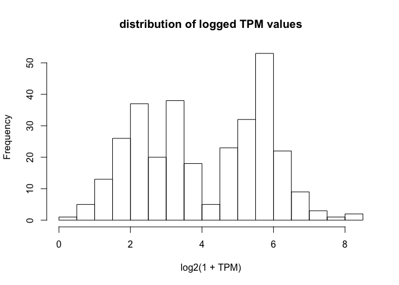
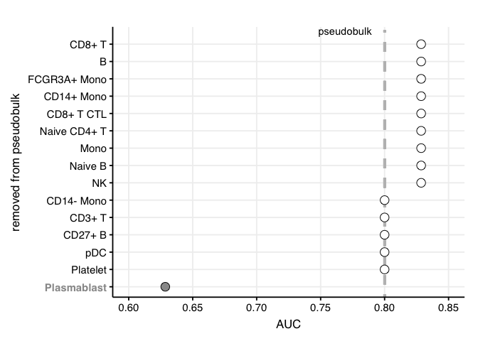
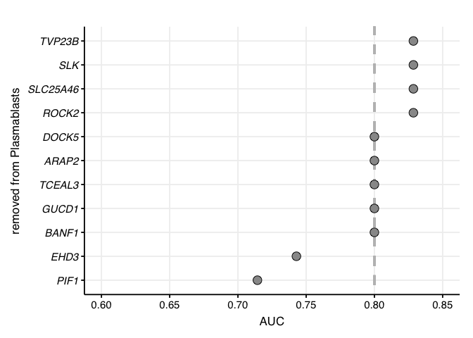

Fig 5 - cell specific signature expression
================

<a href="https://github.com/giannimonaco/ABIS/tree/master/data">data
source</a>

``` r
source("../scripts/helper_functions.R")
library(dplyr)
library(ggplot2)

# defining signature genes
signature_genes <- c(
  "PIF1", "GUCD1", "EHD3", "TCEAL3", "BANF1",
  "ARAP2", "SLC25A46", "SLK", "ROCK2", "TVP23B", "DOCK5"
)

# reading Monaco dataset on cell-specific gene expression in human blood
# downloaded from https://github.com/giannimonaco/ABIS/tree/master/data
monaco_dir <- "../../data/prior_info/monaco_dataset/"

gene_annotation <- read.delim2(paste0(monaco_dir, "Annotation_genes.txt"),
  stringsAsFactors = F
) %>%
  dplyr::filter(Gene.Symbol %in% signature_genes)

blood_cells_TPM <- read.table(paste0(monaco_dir, "Median_TPMTMM_values.txt"),
  stringsAsFactors = F, strip.white = T
)

blood_cells_TPM_signature <- merge(blood_cells_TPM, gene_annotation,
  by.x = "row.names",
  by.y = "Ensembl.ID"
) %>%
  select(-Entrez.ID, -Row.names, -PBMCs, -Progenitors) %>%
  mutate_at(vars(-"Gene.Symbol"), ~(log2(1 + .)))

# determine expression cutoff based on the
# distribution of expression values
blood_cells_TPM_signature %>%
  dplyr::select(-Gene.Symbol) %>%
  as.matrix() %>%
  hist(20, xlab = "log2(1 + TPM)", main = "distribution of logged TPM values")
```

<!-- -->

``` r
TPM_cutoff <- 4

blood_cells_TPM_signature_discretized <- apply(
  blood_cells_TPM_signature %>%
    tibble::column_to_rownames("Gene.Symbol"), 1,
  function(x) {
    ifelse(x > TPM_cutoff,
      "high expression",
      "low expression"
    )
  }
)

kableExtra::kable(blood_cells_TPM_signature_discretized)
```

<table>

<thead>

<tr>

<th style="text-align:left;">

</th>

<th style="text-align:left;">

EHD3

</th>

<th style="text-align:left;">

ARAP2

</th>

<th style="text-align:left;">

SLK

</th>

<th style="text-align:left;">

ROCK2

</th>

<th style="text-align:left;">

GUCD1

</th>

<th style="text-align:left;">

PIF1

</th>

<th style="text-align:left;">

DOCK5

</th>

<th style="text-align:left;">

SLC25A46

</th>

<th style="text-align:left;">

TVP23B

</th>

<th style="text-align:left;">

BANF1

</th>

<th style="text-align:left;">

TCEAL3

</th>

</tr>

</thead>

<tbody>

<tr>

<td style="text-align:left;">

pDCs

</td>

<td style="text-align:left;">

low expression

</td>

<td style="text-align:left;">

high expression

</td>

<td style="text-align:left;">

low expression

</td>

<td style="text-align:left;">

low expression

</td>

<td style="text-align:left;">

high expression

</td>

<td style="text-align:left;">

low expression

</td>

<td style="text-align:left;">

low expression

</td>

<td style="text-align:left;">

high expression

</td>

<td style="text-align:left;">

high expression

</td>

<td style="text-align:left;">

high expression

</td>

<td style="text-align:left;">

low expression

</td>

</tr>

<tr>

<td style="text-align:left;">

Basophils.LD

</td>

<td style="text-align:left;">

low expression

</td>

<td style="text-align:left;">

low expression

</td>

<td style="text-align:left;">

low expression

</td>

<td style="text-align:left;">

high expression

</td>

<td style="text-align:left;">

high expression

</td>

<td style="text-align:left;">

low expression

</td>

<td style="text-align:left;">

high expression

</td>

<td style="text-align:left;">

high expression

</td>

<td style="text-align:left;">

high expression

</td>

<td style="text-align:left;">

high expression

</td>

<td style="text-align:left;">

low expression

</td>

</tr>

<tr>

<td style="text-align:left;">

Neutrophils.LD

</td>

<td style="text-align:left;">

low expression

</td>

<td style="text-align:left;">

low expression

</td>

<td style="text-align:left;">

high expression

</td>

<td style="text-align:left;">

low expression

</td>

<td style="text-align:left;">

high expression

</td>

<td style="text-align:left;">

low expression

</td>

<td style="text-align:left;">

high expression

</td>

<td style="text-align:left;">

high expression

</td>

<td style="text-align:left;">

high expression

</td>

<td style="text-align:left;">

low expression

</td>

<td style="text-align:left;">

low expression

</td>

</tr>

<tr>

<td style="text-align:left;">

mDCs

</td>

<td style="text-align:left;">

low expression

</td>

<td style="text-align:left;">

low expression

</td>

<td style="text-align:left;">

low expression

</td>

<td style="text-align:left;">

low expression

</td>

<td style="text-align:left;">

high expression

</td>

<td style="text-align:left;">

low expression

</td>

<td style="text-align:left;">

high expression

</td>

<td style="text-align:left;">

high expression

</td>

<td style="text-align:left;">

high expression

</td>

<td style="text-align:left;">

high expression

</td>

<td style="text-align:left;">

low expression

</td>

</tr>

<tr>

<td style="text-align:left;">

Monocytes.C

</td>

<td style="text-align:left;">

low expression

</td>

<td style="text-align:left;">

high expression

</td>

<td style="text-align:left;">

low expression

</td>

<td style="text-align:left;">

low expression

</td>

<td style="text-align:left;">

high expression

</td>

<td style="text-align:left;">

low expression

</td>

<td style="text-align:left;">

high expression

</td>

<td style="text-align:left;">

high expression

</td>

<td style="text-align:left;">

high expression

</td>

<td style="text-align:left;">

high expression

</td>

<td style="text-align:left;">

low expression

</td>

</tr>

<tr>

<td style="text-align:left;">

Monocytes.I

</td>

<td style="text-align:left;">

low expression

</td>

<td style="text-align:left;">

high expression

</td>

<td style="text-align:left;">

low expression

</td>

<td style="text-align:left;">

low expression

</td>

<td style="text-align:left;">

high expression

</td>

<td style="text-align:left;">

low expression

</td>

<td style="text-align:left;">

high expression

</td>

<td style="text-align:left;">

high expression

</td>

<td style="text-align:left;">

high expression

</td>

<td style="text-align:left;">

high expression

</td>

<td style="text-align:left;">

low expression

</td>

</tr>

<tr>

<td style="text-align:left;">

Monocytes.NC

</td>

<td style="text-align:left;">

low expression

</td>

<td style="text-align:left;">

high expression

</td>

<td style="text-align:left;">

low expression

</td>

<td style="text-align:left;">

low expression

</td>

<td style="text-align:left;">

high expression

</td>

<td style="text-align:left;">

low expression

</td>

<td style="text-align:left;">

high expression

</td>

<td style="text-align:left;">

high expression

</td>

<td style="text-align:left;">

high expression

</td>

<td style="text-align:left;">

high expression

</td>

<td style="text-align:left;">

low expression

</td>

</tr>

<tr>

<td style="text-align:left;">

B.Naive

</td>

<td style="text-align:left;">

low expression

</td>

<td style="text-align:left;">

high expression

</td>

<td style="text-align:left;">

low expression

</td>

<td style="text-align:left;">

low expression

</td>

<td style="text-align:left;">

high expression

</td>

<td style="text-align:left;">

low expression

</td>

<td style="text-align:left;">

low expression

</td>

<td style="text-align:left;">

high expression

</td>

<td style="text-align:left;">

high expression

</td>

<td style="text-align:left;">

high expression

</td>

<td style="text-align:left;">

low expression

</td>

</tr>

<tr>

<td style="text-align:left;">

B.NSM

</td>

<td style="text-align:left;">

high expression

</td>

<td style="text-align:left;">

high expression

</td>

<td style="text-align:left;">

low expression

</td>

<td style="text-align:left;">

low expression

</td>

<td style="text-align:left;">

high expression

</td>

<td style="text-align:left;">

low expression

</td>

<td style="text-align:left;">

low expression

</td>

<td style="text-align:left;">

high expression

</td>

<td style="text-align:left;">

high expression

</td>

<td style="text-align:left;">

high expression

</td>

<td style="text-align:left;">

low expression

</td>

</tr>

<tr>

<td style="text-align:left;">

B.SM

</td>

<td style="text-align:left;">

high expression

</td>

<td style="text-align:left;">

high expression

</td>

<td style="text-align:left;">

low expression

</td>

<td style="text-align:left;">

low expression

</td>

<td style="text-align:left;">

high expression

</td>

<td style="text-align:left;">

low expression

</td>

<td style="text-align:left;">

low expression

</td>

<td style="text-align:left;">

high expression

</td>

<td style="text-align:left;">

high expression

</td>

<td style="text-align:left;">

high expression

</td>

<td style="text-align:left;">

low expression

</td>

</tr>

<tr>

<td style="text-align:left;">

B.Ex

</td>

<td style="text-align:left;">

high expression

</td>

<td style="text-align:left;">

high expression

</td>

<td style="text-align:left;">

low expression

</td>

<td style="text-align:left;">

low expression

</td>

<td style="text-align:left;">

high expression

</td>

<td style="text-align:left;">

low expression

</td>

<td style="text-align:left;">

low expression

</td>

<td style="text-align:left;">

high expression

</td>

<td style="text-align:left;">

high expression

</td>

<td style="text-align:left;">

high expression

</td>

<td style="text-align:left;">

low expression

</td>

</tr>

<tr>

<td style="text-align:left;">

Plasmablasts

</td>

<td style="text-align:left;">

high expression

</td>

<td style="text-align:left;">

low expression

</td>

<td style="text-align:left;">

low expression

</td>

<td style="text-align:left;">

high expression

</td>

<td style="text-align:left;">

high expression

</td>

<td style="text-align:left;">

high expression

</td>

<td style="text-align:left;">

low expression

</td>

<td style="text-align:left;">

high expression

</td>

<td style="text-align:left;">

high expression

</td>

<td style="text-align:left;">

high expression

</td>

<td style="text-align:left;">

low expression

</td>

</tr>

<tr>

<td style="text-align:left;">

T.CD4.Naive

</td>

<td style="text-align:left;">

low expression

</td>

<td style="text-align:left;">

high expression

</td>

<td style="text-align:left;">

low expression

</td>

<td style="text-align:left;">

low expression

</td>

<td style="text-align:left;">

high expression

</td>

<td style="text-align:left;">

low expression

</td>

<td style="text-align:left;">

low expression

</td>

<td style="text-align:left;">

high expression

</td>

<td style="text-align:left;">

high expression

</td>

<td style="text-align:left;">

high expression

</td>

<td style="text-align:left;">

low expression

</td>

</tr>

<tr>

<td style="text-align:left;">

Tfh

</td>

<td style="text-align:left;">

low expression

</td>

<td style="text-align:left;">

high expression

</td>

<td style="text-align:left;">

low expression

</td>

<td style="text-align:left;">

low expression

</td>

<td style="text-align:left;">

high expression

</td>

<td style="text-align:left;">

low expression

</td>

<td style="text-align:left;">

low expression

</td>

<td style="text-align:left;">

high expression

</td>

<td style="text-align:left;">

high expression

</td>

<td style="text-align:left;">

high expression

</td>

<td style="text-align:left;">

low expression

</td>

</tr>

<tr>

<td style="text-align:left;">

Tregs

</td>

<td style="text-align:left;">

low expression

</td>

<td style="text-align:left;">

high expression

</td>

<td style="text-align:left;">

low expression

</td>

<td style="text-align:left;">

low expression

</td>

<td style="text-align:left;">

high expression

</td>

<td style="text-align:left;">

low expression

</td>

<td style="text-align:left;">

low expression

</td>

<td style="text-align:left;">

high expression

</td>

<td style="text-align:left;">

high expression

</td>

<td style="text-align:left;">

high expression

</td>

<td style="text-align:left;">

low expression

</td>

</tr>

<tr>

<td style="text-align:left;">

Th1

</td>

<td style="text-align:left;">

low expression

</td>

<td style="text-align:left;">

high expression

</td>

<td style="text-align:left;">

low expression

</td>

<td style="text-align:left;">

low expression

</td>

<td style="text-align:left;">

high expression

</td>

<td style="text-align:left;">

low expression

</td>

<td style="text-align:left;">

low expression

</td>

<td style="text-align:left;">

high expression

</td>

<td style="text-align:left;">

high expression

</td>

<td style="text-align:left;">

high expression

</td>

<td style="text-align:left;">

low expression

</td>

</tr>

<tr>

<td style="text-align:left;">

Th1.Th17

</td>

<td style="text-align:left;">

low expression

</td>

<td style="text-align:left;">

high expression

</td>

<td style="text-align:left;">

low expression

</td>

<td style="text-align:left;">

low expression

</td>

<td style="text-align:left;">

high expression

</td>

<td style="text-align:left;">

low expression

</td>

<td style="text-align:left;">

low expression

</td>

<td style="text-align:left;">

high expression

</td>

<td style="text-align:left;">

high expression

</td>

<td style="text-align:left;">

high expression

</td>

<td style="text-align:left;">

low expression

</td>

</tr>

<tr>

<td style="text-align:left;">

Th17

</td>

<td style="text-align:left;">

low expression

</td>

<td style="text-align:left;">

high expression

</td>

<td style="text-align:left;">

low expression

</td>

<td style="text-align:left;">

low expression

</td>

<td style="text-align:left;">

high expression

</td>

<td style="text-align:left;">

low expression

</td>

<td style="text-align:left;">

low expression

</td>

<td style="text-align:left;">

high expression

</td>

<td style="text-align:left;">

high expression

</td>

<td style="text-align:left;">

high expression

</td>

<td style="text-align:left;">

low expression

</td>

</tr>

<tr>

<td style="text-align:left;">

Th2

</td>

<td style="text-align:left;">

low expression

</td>

<td style="text-align:left;">

high expression

</td>

<td style="text-align:left;">

low expression

</td>

<td style="text-align:left;">

low expression

</td>

<td style="text-align:left;">

high expression

</td>

<td style="text-align:left;">

low expression

</td>

<td style="text-align:left;">

low expression

</td>

<td style="text-align:left;">

high expression

</td>

<td style="text-align:left;">

high expression

</td>

<td style="text-align:left;">

high expression

</td>

<td style="text-align:left;">

low expression

</td>

</tr>

<tr>

<td style="text-align:left;">

T.CD4.TE

</td>

<td style="text-align:left;">

low expression

</td>

<td style="text-align:left;">

high expression

</td>

<td style="text-align:left;">

low expression

</td>

<td style="text-align:left;">

low expression

</td>

<td style="text-align:left;">

high expression

</td>

<td style="text-align:left;">

low expression

</td>

<td style="text-align:left;">

low expression

</td>

<td style="text-align:left;">

high expression

</td>

<td style="text-align:left;">

high expression

</td>

<td style="text-align:left;">

high expression

</td>

<td style="text-align:left;">

low expression

</td>

</tr>

<tr>

<td style="text-align:left;">

T.CD8.Naive

</td>

<td style="text-align:left;">

low expression

</td>

<td style="text-align:left;">

high expression

</td>

<td style="text-align:left;">

low expression

</td>

<td style="text-align:left;">

low expression

</td>

<td style="text-align:left;">

high expression

</td>

<td style="text-align:left;">

low expression

</td>

<td style="text-align:left;">

low expression

</td>

<td style="text-align:left;">

high expression

</td>

<td style="text-align:left;">

high expression

</td>

<td style="text-align:left;">

high expression

</td>

<td style="text-align:left;">

low expression

</td>

</tr>

<tr>

<td style="text-align:left;">

T.CD8.CM

</td>

<td style="text-align:left;">

low expression

</td>

<td style="text-align:left;">

high expression

</td>

<td style="text-align:left;">

low expression

</td>

<td style="text-align:left;">

low expression

</td>

<td style="text-align:left;">

high expression

</td>

<td style="text-align:left;">

low expression

</td>

<td style="text-align:left;">

low expression

</td>

<td style="text-align:left;">

high expression

</td>

<td style="text-align:left;">

high expression

</td>

<td style="text-align:left;">

high expression

</td>

<td style="text-align:left;">

low expression

</td>

</tr>

<tr>

<td style="text-align:left;">

T.CD8.EM

</td>

<td style="text-align:left;">

low expression

</td>

<td style="text-align:left;">

high expression

</td>

<td style="text-align:left;">

low expression

</td>

<td style="text-align:left;">

low expression

</td>

<td style="text-align:left;">

high expression

</td>

<td style="text-align:left;">

low expression

</td>

<td style="text-align:left;">

low expression

</td>

<td style="text-align:left;">

high expression

</td>

<td style="text-align:left;">

high expression

</td>

<td style="text-align:left;">

high expression

</td>

<td style="text-align:left;">

low expression

</td>

</tr>

<tr>

<td style="text-align:left;">

T.CD8.TE

</td>

<td style="text-align:left;">

low expression

</td>

<td style="text-align:left;">

high expression

</td>

<td style="text-align:left;">

low expression

</td>

<td style="text-align:left;">

low expression

</td>

<td style="text-align:left;">

high expression

</td>

<td style="text-align:left;">

low expression

</td>

<td style="text-align:left;">

low expression

</td>

<td style="text-align:left;">

high expression

</td>

<td style="text-align:left;">

high expression

</td>

<td style="text-align:left;">

high expression

</td>

<td style="text-align:left;">

low expression

</td>

</tr>

<tr>

<td style="text-align:left;">

MAIT

</td>

<td style="text-align:left;">

low expression

</td>

<td style="text-align:left;">

high expression

</td>

<td style="text-align:left;">

low expression

</td>

<td style="text-align:left;">

low expression

</td>

<td style="text-align:left;">

high expression

</td>

<td style="text-align:left;">

low expression

</td>

<td style="text-align:left;">

low expression

</td>

<td style="text-align:left;">

high expression

</td>

<td style="text-align:left;">

high expression

</td>

<td style="text-align:left;">

high expression

</td>

<td style="text-align:left;">

low expression

</td>

</tr>

<tr>

<td style="text-align:left;">

T.gd.Vd2

</td>

<td style="text-align:left;">

low expression

</td>

<td style="text-align:left;">

high expression

</td>

<td style="text-align:left;">

low expression

</td>

<td style="text-align:left;">

low expression

</td>

<td style="text-align:left;">

high expression

</td>

<td style="text-align:left;">

low expression

</td>

<td style="text-align:left;">

low expression

</td>

<td style="text-align:left;">

high expression

</td>

<td style="text-align:left;">

high expression

</td>

<td style="text-align:left;">

high expression

</td>

<td style="text-align:left;">

low expression

</td>

</tr>

<tr>

<td style="text-align:left;">

T.gd.non.Vd2

</td>

<td style="text-align:left;">

low expression

</td>

<td style="text-align:left;">

high expression

</td>

<td style="text-align:left;">

low expression

</td>

<td style="text-align:left;">

low expression

</td>

<td style="text-align:left;">

high expression

</td>

<td style="text-align:left;">

low expression

</td>

<td style="text-align:left;">

low expression

</td>

<td style="text-align:left;">

high expression

</td>

<td style="text-align:left;">

high expression

</td>

<td style="text-align:left;">

high expression

</td>

<td style="text-align:left;">

low expression

</td>

</tr>

<tr>

<td style="text-align:left;">

NK

</td>

<td style="text-align:left;">

low expression

</td>

<td style="text-align:left;">

high expression

</td>

<td style="text-align:left;">

low expression

</td>

<td style="text-align:left;">

low expression

</td>

<td style="text-align:left;">

high expression

</td>

<td style="text-align:left;">

low expression

</td>

<td style="text-align:left;">

high expression

</td>

<td style="text-align:left;">

high expression

</td>

<td style="text-align:left;">

high expression

</td>

<td style="text-align:left;">

high expression

</td>

<td style="text-align:left;">

low expression

</td>

</tr>

</tbody>

</table>

Plotting results from scRNA-seq data to show the role of plasmablasts in
COVID-19 detection with a leave-one-cell-out analysis

``` r
GSE155673_fig_5_plots <- readRDS("../../data/scRNA_analysis_Fig5/GSE155673_fig_5_plots.RDS")

fig_5_panel_B_data <- GSE155673_fig_5_plots$A$data %>%
  filter(Cell.Type != "unknown") %>%
  mutate(Cell.Type = droplevels(Cell.Type), cell = "not")
fig_5_panel_B_data$cell[1] <- "yes"

plasmablast_color <- "gray60"
p_fig_5_panel_B <-
  ggplot(fig_5_panel_B_data, aes(x = Cell.Type, y = AUC)) +
  ylim(c(0.6, 0.85)) +
  geom_segment(
    x = 0,
    xend = 15.8,
    y = 0.8,
    yend = 0.8,
    linetype = "dashed",
    color = "gray",
    size = 1.2
  ) +
  geom_point(aes(fill = cell),
    size = 4,
    pch = 21,
    colour = "black"
  ) +
  scale_fill_manual(values = c("white", plasmablast_color)) +
  coord_flip() +
  ylab("cell type") +
  theme_Publication() +
  annotate(
    "text",
    x = 16,
    y = 0.79,
    label = "pseudobulk",
    vjust = "inward",
    hjust = "inward"
  ) +
  theme(legend.position = "none") +
  xlab("removed from pseudobulk") +
  ylab("AUC") +
  theme(axis.text.y = element_text(
    colour = ifelse(fig_5_panel_B_data$cell == "yes", plasmablast_color, "black"),
    face = ifelse(fig_5_panel_B_data$cell == "yes", "bold", "plain")
  ))
```

    ## Warning: Vectorized input to `element_text()` is not officially supported.
    ## Results may be unexpected or may change in future versions of ggplot2.

``` r
p_fig_5_panel_B
```

<!-- -->

Plotting results from scRNA-seq data to show the role of signature genes
in plasmablast-mediated COVID-19 detection

``` r
fig_5_panel_C_data <- GSE155673_fig_5_plots$B$data

p_fig_5_panel_C <-
  ggplot(fig_5_panel_C_data, aes(x = gene, y = AUC)) +
  ylim(c(0.6, 0.85)) +
  geom_segment(
    x = 0,
    xend = 15.8,
    y = 0.8,
    yend = 0.8,
    linetype = "dashed",
    color = "gray",
    size = 1.2
  ) +
  geom_point(
    size = 4,
    fill = plasmablast_color,
    pch = 21,
    colour = "black"
  ) +
  coord_flip() +
  ylab("cell type") +
  theme_Publication() +
  xlab("removed from Plasmablasts") +
  ylab("AUC") +
  theme(axis.text.y = element_text(face = "italic")) 

p_fig_5_panel_C
```

<!-- -->
