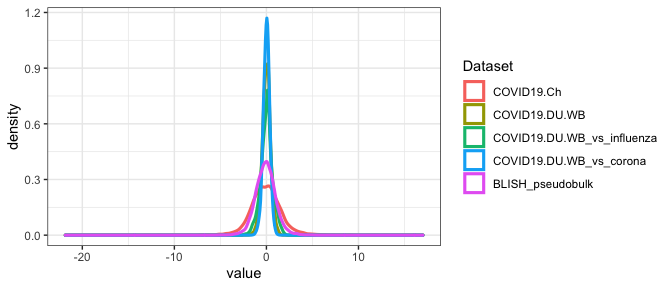
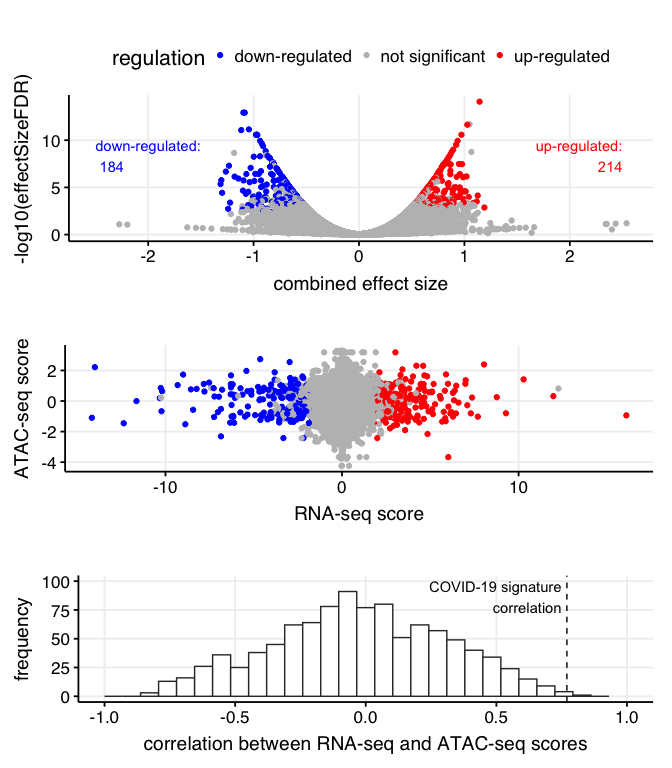

Fig S1 - meta-analysis of COVID-19 training studies
================

``` r
source("../scripts/helper_functions.R")
library(dplyr)
library(ggplot2)
library(MetaIntegrator)

all_contrasts_dict <-
  readRDS("../../data/mRNA_studies/all_contrasts_dict.RDS")

# selecting COVID-19 discovery studies
COVID_contrasts_discovery_idx <- which(all_contrasts_dict$class1 == 'COVID-19' &
                                         all_contrasts_dict$use == "discovery")

all_contrasts <-
  readRDS("../../data/mRNA_studies/all_contrasts.RDS")

COVID_contrasts_discovery <-
  all_contrasts[COVID_contrasts_discovery_idx]

# defining meta-integrator object
COVID_discovery_meta_object <-
  list(originalData = COVID_contrasts_discovery)
checkDataObject(COVID_discovery_meta_object, "Meta", "Pre-Analysis")
```

    ## [1] TRUE

``` r
# run meta-analysis using the meta-integrator package
COVID_discovery_meta_analysis <- runMetaAnalysis(
  COVID_discovery_meta_object,
  maxCores = 1,
  runLeaveOneOutAnalysis = T
)
```

    ## Found common probes in 2 
    ## Found common probes in 3 
    ## Found common probes in 4 
    ## Found common probes in 5 
    ## Computing effect sizes...
    ## Computing summary effect sizes...
    ## Computing Fisher's output...

<!-- -->

    ## Found common probes in 2 
    ## Found common probes in 3 
    ## Found common probes in 4 
    ## Computing effect sizes...
    ## Computing summary effect sizes...
    ## Computing Fisher's output...Found common probes in 2 
    ## Found common probes in 3 
    ## Found common probes in 4 
    ## Computing effect sizes...
    ## Computing summary effect sizes...
    ## Computing Fisher's output...Found common probes in 2 
    ## Found common probes in 3 
    ## Found common probes in 4 
    ## Computing effect sizes...
    ## Computing summary effect sizes...
    ## Computing Fisher's output...Found common probes in 2 
    ## Found common probes in 3 
    ## Found common probes in 4 
    ## Computing effect sizes...
    ## Computing summary effect sizes...
    ## Computing Fisher's output...Found common probes in 2 
    ## Found common probes in 3 
    ## Found common probes in 4 
    ## Computing effect sizes...
    ## Computing summary effect sizes...
    ## Computing Fisher's output...

``` r
meta_integrator_plot <- last_plot()
meta_integrator_modified_plot <- last_plot() +
  theme_Publication() + theme(text = element_text(size = 14)) +
  theme(legend.position = "right")


# filter results
filter_object <- filterGenes(
  COVID_discovery_meta_analysis,
  isLeaveOneOut = T,
  FDRThresh = 0.05,
  effectSizeThresh = 0.5,
  numberStudiesThresh = 5
)

# get filter object
filter_object <- filter_object$filterResults[[1]]

# get pooled results
pooled_results <-
  COVID_discovery_meta_analysis$metaAnalysis$pooledResults %>%
  tibble::rownames_to_column("gene") %>%
  dplyr::mutate(
    RNA_seq_score = -log10(effectSizeFDR) * effectSize,
    regulation = "not significant"
  )

# rewrite in dplyr
pooled_results[which(pooled_results$gene %in% filter_object$posGeneNames), "regulation"] <-
  "up-regulated"
pooled_results[which(pooled_results$gene %in% filter_object$negGeneNames), "regulation"] <-
  "down-regulated"

regulated_table <-
  pooled_results %>%
  dplyr::select(regulation) %>%
  table()

p_scatter_RNA <- ggplot(
  pooled_results,
  aes(
    x = effectSize,
    y = -log10(effectSizeFDR)
  )
) +
  geom_point(aes(col = regulation)) +
  ggpubr::theme_pubclean() +
  scale_color_manual(values = c("blue", "gray", "red")) +
  xlab("combined effect size") +
  theme_Publication() +
  theme(legend.position = "top") +
  theme(text = element_text(size = 16)) +
  annotate(
    "text",
    x = -2.5,
    y = 10,
    label = paste("down-regulated:\n", regulated_table["down-regulated"]),
    vjust = "inward",
    hjust = "inward",
    color = "blue",
  ) +
  annotate(
    "text",
    x = 2.5,
    y = 10,
    label = paste("up-regulated:\n", regulated_table["up-regulated"]),
    vjust = "inward",
    hjust = "inward",
    color = "red",
  )
```

Correlation between transcriptional and epigenetic regulation

``` r
COVID19_ATAC_analysis <- read.csv2("../../results/suppl_tables/COVID-19_Duke_PBMC_ATAC_gene_summary.csv")

pooled_results_with_ATAC <- merge(pooled_results, COVID19_ATAC_analysis,
  by = "gene"
)

p_scatter_RNA_ATAC <- ggplot(
  pooled_results_with_ATAC,
  aes(
    x = RNA_seq_score,
    y = ATAC_score
  )
) +
  geom_point(aes(col = regulation)) +
  scale_color_manual(values = c("blue", "gray", "red")) +
  theme_Publication() +
  xlab("RNA-seq score") +
  ylab("ATAC-seq score") +
  theme(legend.position = "none") +
  theme(text = element_text(size = 16))

# resampling analysis to assess the correlation between RNA and ATAC
# for randomly extracted signatures made of differentially expressed genes
pooled_results_with_ATAC_significant_genes <- pooled_results_with_ATAC %>%
  dplyr::filter(regulation != "not significant")

n_samples <- 1000
random_signature_correlation <- vector(length = n_samples)
random_signature_size <- 11
set.seed(1234)
for (k in 1:n_samples) {
  random_signature_idx <- sample(1:nrow(pooled_results_with_ATAC_significant_genes),
    size = random_signature_size
  )
  mRNA_scores <- pooled_results_with_ATAC_significant_genes %>%
    dplyr::slice(random_signature_idx) %>%
    dplyr::select(RNA_seq_score) %>%
    pull()

  ATAC_scores <- pooled_results_with_ATAC_significant_genes %>%
    dplyr::slice(random_signature_idx) %>%
    dplyr::select(ATAC_score) %>%
    pull()

  random_signature_correlation[k] <- cor(mRNA_scores, ATAC_scores)
}

random_signature_correlation <- data.frame(corr = random_signature_correlation)
p_corr_analysis <- ggplot(random_signature_correlation, aes(corr)) +
  geom_histogram(fill = "white", color = "gray20") +
  xlab("correlation between RNA-seq and ATAC-seq scores") +
  ylab("frequency") +
  xlim(c(-1, 1)) +
  theme_Publication() +
  theme(text = element_text(size = 16)) +
  geom_vline(xintercept = 0.77, linetype = "dashed") +
  annotate(
    "text",
    x = 0.75,
    y = 100,
    label = paste("COVID-19 signature\n correlation"),
    vjust = "inward",
    hjust = "inward",
  )


sum(random_signature_correlation$corr > 0.77) /
  nrow(random_signature_correlation)
```

    ## [1] 0.001

``` r
# plotting Figure S1
gridExtra::grid.arrange(
  p_scatter_RNA,
  p_scatter_RNA_ATAC,
  p_corr_analysis,
  ncol = 1,
  heights = c(0.4, 0.3, 0.3)
)
```

    ## Warning: Removed 2 rows containing missing values (geom_bar).

<!-- -->
