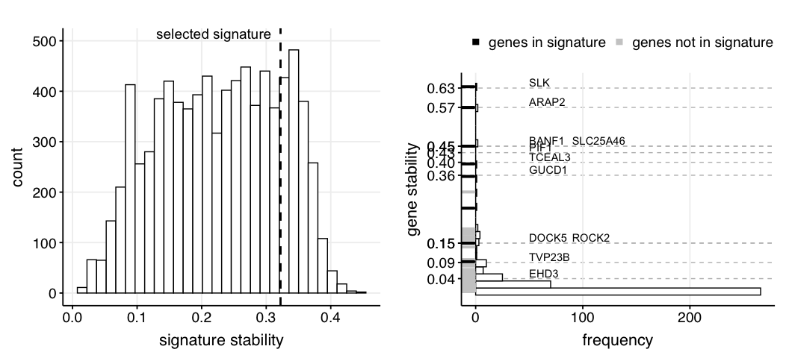

Fig S2 - Stability analysis of solution space
================

Here we perform a global stability analysis of the solution space. We
define a stability value at the gene and solution levels. At the gene
level, stability is the frequency at which a given gene appears in the
solution space. At the solution (signature) level, stability is the mean
of stability of the genes contained in the solution.

``` r
library(dplyr)
library(ggplot2)
source("../scripts/helper_functions.R")
filter_object <- readRDS("../../data/mRNA_studies/filter_object.RDS")
pool_of_genes <- c(filter_object$posGeneNames, filter_object$negGeneNames)

binary_solution_matrix_file <- "../../data/optimization_results/binary_solution_matrix.RDS"
binary_solution_matrix <- readRDS(binary_solution_matrix_file)

# measure gene stability
gene_stability <- apply(binary_solution_matrix, 2, function(x) {
  sum(x) / length(x)
}) %>%
  reshape2::melt(gene_stability) %>%
  tibble::rownames_to_column("gene") %>%
  rename(stability = value)

solution_stability <- apply(
  binary_solution_matrix, 1,
  function(x) {
    mean(gene_stability[
      which(x == 1),
      "stability"
    ])
  }
)
```

### Checking the stability of the selected COVID-19 signature

``` r
# this is the index of the selected COVID-19 signature from the
# space of candidate solutions generated with the genetic algorithm
selected_solution_idx <- 6329
names(binary_solution_matrix)[which(binary_solution_matrix[selected_solution_idx, ] == 1)]
```

    ##  [1] "PIF1"     "TCEAL3"   "BANF1"    "EHD3"     "GUCD1"    "DOCK5"   
    ##  [7] "TVP23B"   "SLK"      "SLC25A46" "ARAP2"    "ROCK2"

``` r
solution_stability_df <- reshape2::melt(solution_stability) %>%
  tibble::rownames_to_column("solution") %>%
  rename(stability = value)

p_solution_stability <- ggplot(solution_stability_df, aes(x = stability)) +
  theme_Publication() +
  geom_histogram(color = "black", fill = "white") +
  theme(text = element_text(size = 18)) +
  geom_vline(
    xintercept = solution_stability[selected_solution_idx],
    linetype = "dashed",
    size = 1
  ) +
  xlab("signature stability") +
  annotate(
    "text",
    x = 0.13,
    y = 500,
    label = "selected signature",
    vjust = -0.2,
    hjust = 0,
    size  = 5
  )
```

### Plotting the results from the stability analysis

``` r
selected_solution <- as.numeric(binary_solution_matrix[selected_solution_idx, ])
genes_in_solution <- names(binary_solution_matrix)[which(selected_solution ==
  1)]
gene_stability_df <- data.frame(
  gene = pool_of_genes,
  stability = gene_stability$stability
)
gene_stability_df <- gene_stability_df %>%
  dplyr::mutate(
    in_solution = ifelse(
      gene %in% genes_in_solution,
      "genes in signature",
      "genes not in signature"
    )
  )


# adjustment for better visualization
gene_stability_df[gene_stability_df$gene == "SLC25A46", "stability"] <- 0.45
gene_stability_df[gene_stability_df$gene == "BANF1", "stability"] <- 0.45
gene_stability_df[gene_stability_df$gene == "DOCK5", "stability"] <- 0.15
gene_stability_df[gene_stability_df$gene == "ROCK2", "stability"] <- 0.15

gene_stability_in_solution <- gene_stability_df$stability[which(gene_stability_df$gene %in%
  genes_in_solution)] %>% round(2)
gene_stability_in_solution[1] <- 0.43
y_annotation <- rep(50, length(gene_stability_in_solution))
y_annotation[9] <- 90
y_annotation[11] <- 90

# plotting functions
p_histogram <- ggplot(gene_stability_df, aes(x = stability)) +
  geom_histogram(fill = "white", col = "black") +
  coord_flip() +
  geom_rug(aes(col = in_solution),
    size = 1.4,
    length = unit(0.04, "npc")
  ) +
  theme_Publication() +
  theme(legend.position = "top") +
  theme(panel.grid.major.y = element_line(
    colour = "gray",
    size = 0.5,
    linetype = "dashed"
  )) +
  scale_x_continuous(
    breaks = as.numeric(gene_stability_in_solution),
    minor_breaks = NULL
  ) +
  annotate(
    "text",
    x = gene_stability_in_solution,
    y = y_annotation,
    label = genes_in_solution,
    vjust = -0.2,
    hjust = 0
  ) +
  xlab("gene stability") +
  ylab("frequency") +
  scale_color_manual(values = c("black", "gray80")) +
  theme(legend.position = "top") +
  theme(text = element_text(size = rel(4))) +
  theme(text = element_text(size = 18)) +
  guides(color = guide_legend(override.aes = list(size = 3), title = ""))


gridExtra::grid.arrange(p_solution_stability,
  p_histogram,
  nrow = 1
)
```

<!-- -->
