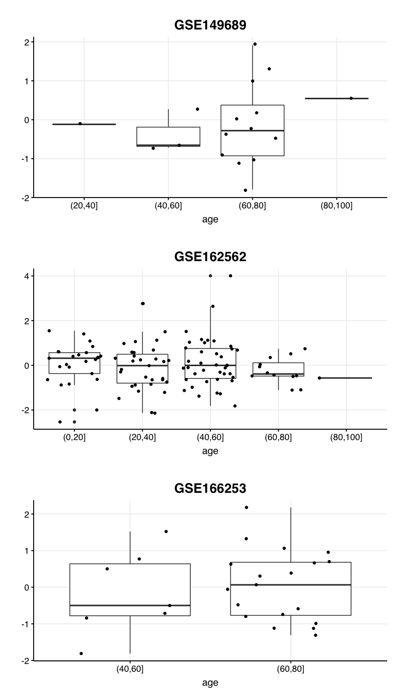
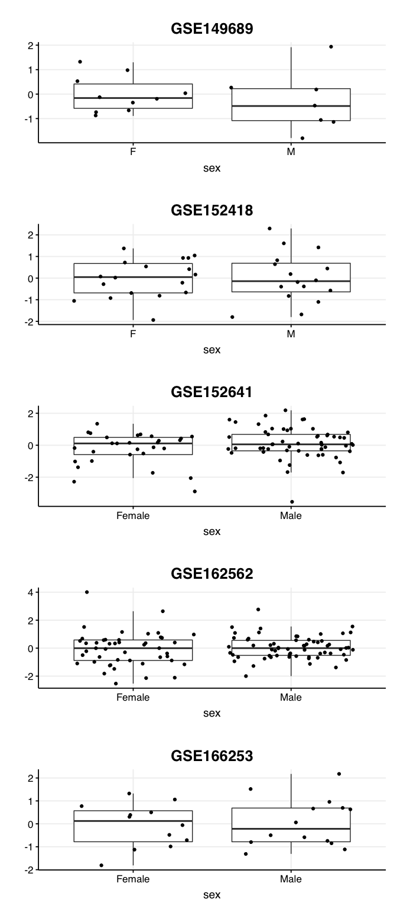

Fig S3 S4 - Impact of age and sex on the COVID-19 signature performance
================

Here we explore whether demographic factors (sex and aging) and disease
severity affects the COVID-19 performance. The analysis is based on
validation studies.

``` r
library(dplyr)
```

    ## Warning: replacing previous import 'vctrs::data_frame' by 'tibble::data_frame'
    ## when loading 'dplyr'

``` r
library(ggplot2)
source("../scripts/helper_functions.R")

COVID19_signature_up <-
  c("PIF1", "GUCD1", "EHD3", "TCEAL3", "BANF1")
COVID19_signature_down <-
  c("ARAP2", "SLC25A46", "SLK", "ROCK2", "TVP23B", "DOCK5")
validation_study_path <- "../../data/mRNA_studies/COVID19_validation/"

GSE149689 <- plot_COVID19_signature_scores(
  study_accession = "GSE149689",
  validation_study_path,
  sex_field = "group.sex",
  age_field = "group.age",
  severity_field = "group.disease"
)
```

    ## Warning: Can't find generic `testthat_print` in package testthat to register S3 method.
    ## ℹ This message is only shown to developers using devtools.
    ## ℹ Do you need to update testthat to the latest version?

    ## Warning: Can't find generic `testthat_print` in package testthat to register S3 method.
    ## Can't find generic `testthat_print` in package testthat to register S3 method.
    ## ℹ This message is only shown to developers using devtools.
    ## ℹ Do you need to update testthat to the latest version?

``` r
GSE152418 <- plot_COVID19_signature_scores(
  study_accession = "GSE152418",
  validation_study_path,
  sex_field = "group.gender.ch1",
  age_field = NA,
  severity_field = "group.severity.ch1"
)

GSE152641 <- plot_COVID19_signature_scores(
  study_accession = "GSE152641",
  validation_study_path,
  sex_field = "group.Sex.ch1",
  age_field = NA,
  severity_field = NA
)

# show systematic age differences in GSE152641
dataset <-
  readRDS(file = "../../data/mRNA_studies/COVID19_validation/GSE152641_preprocessed.RDS")
names(dataset$y) <- make.names(names(dataset$y))
dataset$y <- dataset$y %>%
  dplyr::mutate(
    disease.ch1 = relevel(factor(disease.ch1), ref = "Healthy control"),
    age.ch1 = as.numeric(age.ch1)
  )
```

    ## Warning in mask$eval_all_mutate(dots[[i]]): NAs introduced by coercion

``` r
GSE155454 <- plot_COVID19_signature_scores(
  study_accession = "GSE155454",
  validation_study_path,
  sex_field = NA,
  age_field = NA,
  severity_field = "group.characteristics_ch1.2"
)

GSE157103 <- plot_COVID19_signature_scores(
  study_accession = "GSE157103",
  validation_study_path,
  sex_field = "group.Sex.ch1",
  age_field = NA,
  severity_field = NA
)


GSE162562 <- plot_COVID19_signature_scores(
  study_accession = "GSE162562",
  validation_study_path,
  sex_field = "group.gender.ch1",
  age_field = "group.age.ch1",
  severity_field = "group.severity.ch1"
)

GSE166253 <- plot_COVID19_signature_scores(
  study_accession = "GSE166253",
  validation_study_path,
  sex_field = "group.Sex.ch1",
  age_field = "group.age.ch1",
  severity_field = "group.characteristics_ch1.5"
)
```

### Plotting the impact of age

``` r
gridExtra::grid.arrange(
  GSE149689$age,
  GSE162562$age,
  GSE166253$age,
  ncol = 1
)
```

<!-- -->

### Plotting the impact of sex

``` r
gridExtra::grid.arrange(
  GSE149689$sex,
  GSE152418$sex,
  GSE152641$sex,
  GSE162562$sex,
  GSE166253$sex, 
  ncol = 1
)
```

<!-- -->
