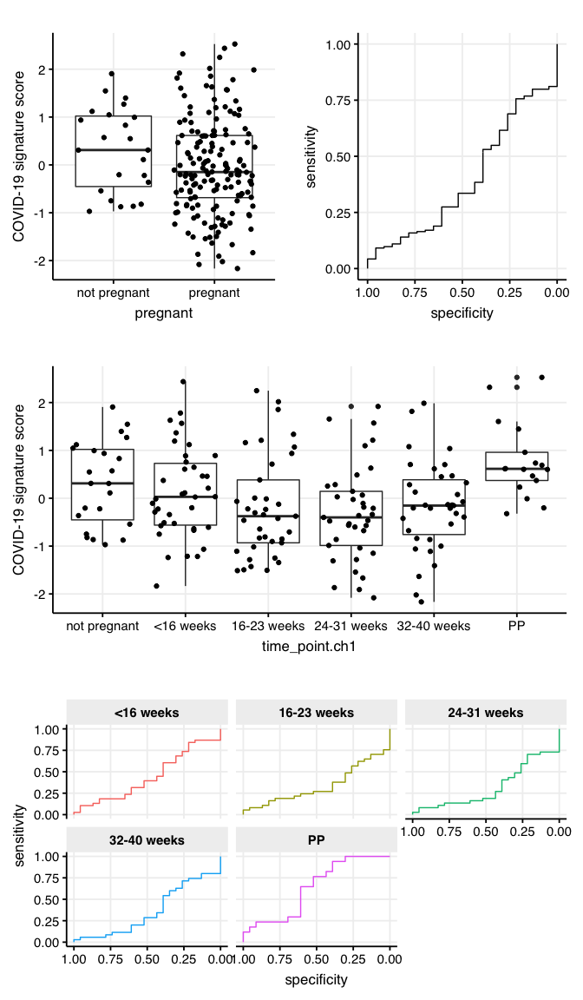

Fig S5 - COVID-19 signature cross-reactivity with pregnancy
================

Here we explore whether the COVID-19 signature cross-reacts with
pregnancy. Pregnancy data is from the study
[GSE108497](https://www.ncbi.nlm.nih.gov/geo/query/acc.cgi?acc=GSE108497).
To reproduce the results, the following additional files are needed:
[GPL10558-50081.txt](https://drive.google.com/file/d/11z5o6lWvJ9ip156QUV6pxax4e2X2q4tj/view?usp=sharing)
and [GSE108497\_normalized\_data.txt](link%20to%20google%20drive).

``` r
library(dplyr)
library(ggplot2)
source("../scripts/helper_functions.R")

COVID19_signature_up <- c("PIF1", "GUCD1", "EHD3", "TCEAL3", "BANF1")
COVID19_signature_down <- c("ARAP2", "SLC25A46", "SLK", "ROCK2", "TVP23B", "DOCK5")

pregnancy_study = GEOquery::getGEO('GSE108497')
pheno_data = Biobase::pData(pregnancy_study[[1]])
feat_data = read.csv2('../../data/mRNA_studies/GPL10558-50081.txt', sep = '\t')

# subset healthy samples
pheno_data_healthy = pheno_data %>% filter(grepl('HC', characteristics_ch1.1))

# subset COVID-19 signature genes
signature_genes = feat_data %>% 
  filter(Symbol %in% c(COVID19_signature_up, COVID19_signature_down)) 

GSE108497 = read.csv2('../../data/mRNA_studies/GSE108497_normalized_data.txt', sep = '\t')

# subset features
GSE108497 = GSE108497 %>% filter(ID_REF %in% as.character(signature_genes$ID))
GSE108497 = merge(GSE108497, signature_genes[, c('ID', 'Symbol')], 
                   by.x = 'ID_REF', by.y = 'ID') %>% dplyr::select(-ID_REF)
# subset samples
GSE108497 = GSE108497[, c('Symbol', make.names(pheno_data_healthy$description))]
GSE108497$Symbol = as.character(GSE108497$Symbol)
GSE108497[, -1] = apply(GSE108497[, -1], 2, as.numeric)

# aggregate multiple measurements for the same genes
GSE108497 = GSE108497 %>% group_by(Symbol) %>% summarise_all(mean)
GSE108497 = GSE108497 %>% tibble::column_to_rownames('Symbol')
GSE108497 = 1 + abs(min(GSE108497)) + GSE108497

# compute the signature score for each sample
COVID19_signature_up_expression <- GSE108497[COVID19_signature_up, ]
COVID19_signature_down_expression <- GSE108497[COVID19_signature_down, ]
sample_score <- scale(
  apply(COVID19_signature_up_expression, 2, function(x) {
    geom_mean(x)
  }) -
    apply(COVID19_signature_down_expression, 2, function(x) {
      geom_mean(x)
    })
)

# prepare dataframe for visualization
pheno_data_healthy$description = make.names(pheno_data_healthy$description)
pheno_data_healthy = merge(pheno_data_healthy, data.frame(sample_score), 
                           by.x = 'description', by.y = 'row.names')

pheno_data_healthy$pregnant = ifelse(grepl('_P_', pheno_data_healthy$characteristics_ch1.1), 
                                     'pregnant', 'not pregnant')

names(pheno_data_healthy) = make.names(names(pheno_data_healthy))
pheno_data_healthy$time_point.ch1[which(is.na(pheno_data_healthy$time_point.ch1))] = 'not pregnant'
pheno_data_healthy$time_point.ch1 = relevel(factor(pheno_data_healthy$time_point.ch1), ref = 'not pregnant')

# plotting Fig. S5
p_box_binary = ggplot(pheno_data_healthy, aes(x = pregnant, y = sample_score)) + 
  geom_boxplot() + geom_jitter() + theme_Publication() + 
  ylab('COVID-19 signature score') 

ROC_binary = pROC::roc(pheno_data_healthy$pregnant, 
                       as.numeric(pheno_data_healthy$sample_score), 
                       direction = '<', levels = c('not pregnant', 'pregnant'))
p_ROC = pROC::ggroc(ROC_binary)  + 
  theme_Publication() + 
  theme(legend.position = 'none')

p_box_tp = ggplot(pheno_data_healthy, aes(x = time_point.ch1, y = sample_score)) + 
  geom_boxplot() + geom_jitter() + theme_Publication() + 
  ylab('COVID-19 signature score') 


Source_levels = c('not pregnant', '<16 weeks', '16-23 weeks', 
                  '24-31 weeks', '32-40 weeks', 'PP')
AUC_values = list()
for (level in Source_levels[-1]){
  pheno_data_healthy_temp = pheno_data_healthy %>% filter(time_point.ch1 %in% c('not pregnant', level))
  AUC_values[[level]] = pROC::auc(pheno_data_healthy_temp$time_point.ch1, 
                                  as.numeric(pheno_data_healthy_temp$sample_score), 
                                  direction = '<', levels = c('not pregnant', level))
}


AUC_values = list()
for (level in Source_levels[-1]){
  pheno_data_healthy_temp = pheno_data_healthy %>% filter(time_point.ch1 %in% c('not pregnant', level))
  AUC_values[[level]] = pROC::roc(pheno_data_healthy_temp$time_point.ch1, 
                                  as.numeric(pheno_data_healthy_temp$sample_score), 
                                  direction = '<', levels = c('not pregnant', level))
}

p_ROC_tp = pROC::ggroc(AUC_values) + facet_wrap(.~name, nrow = 2) + 
  theme_Publication() + 
  theme(legend.position = 'none') 

layout_matrix = rbind(c(1, 2), 
                      c(3, 3), 
                      c(4, 4))

gridExtra::grid.arrange(p_box_binary, 
                        p_ROC, 
                        p_box_tp, 
                        p_ROC_tp, 
                        layout_matrix = layout_matrix)  
```

<!-- -->
